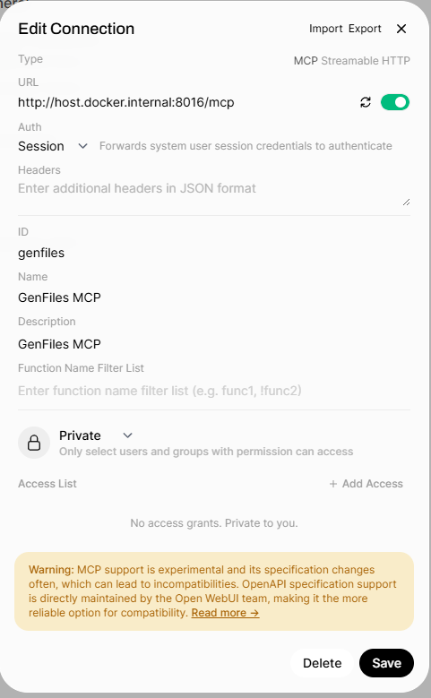
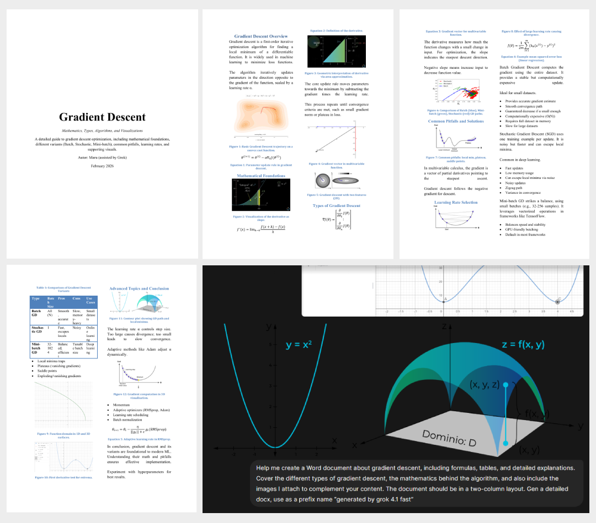
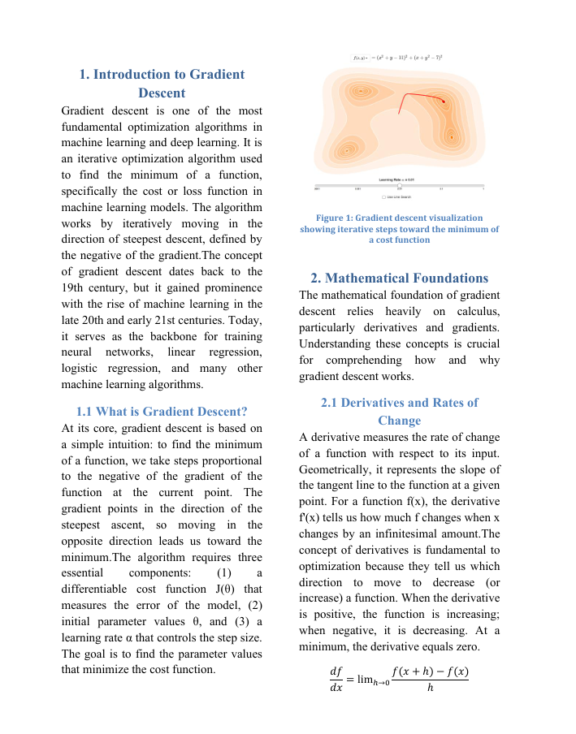
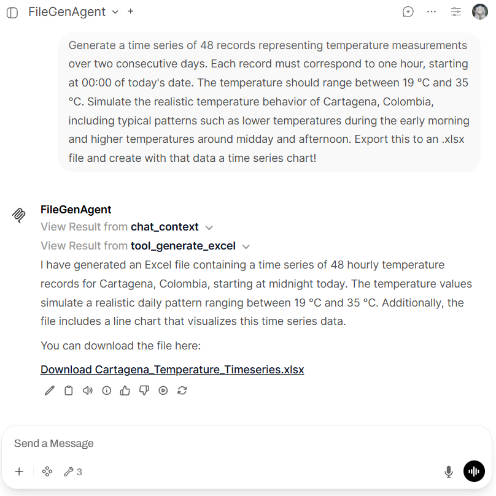
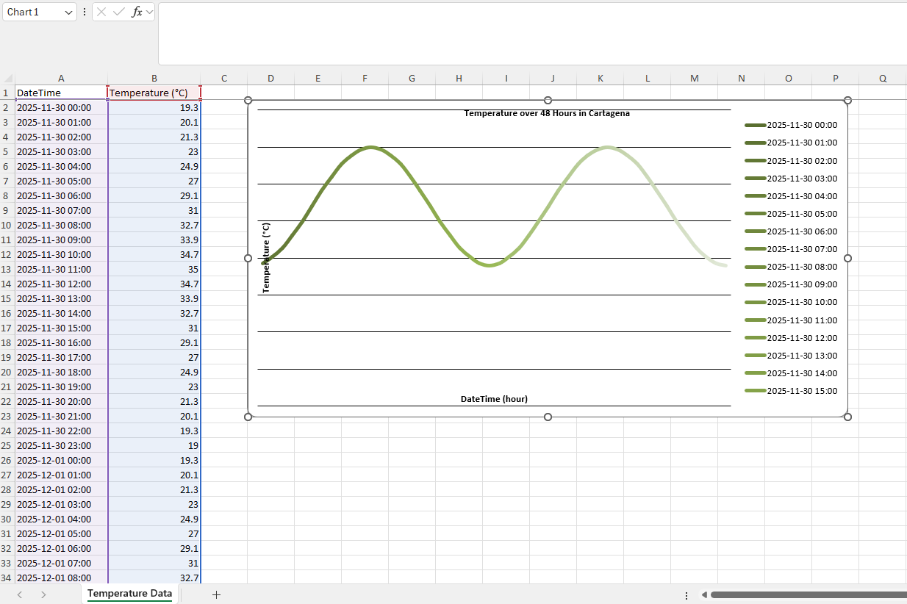
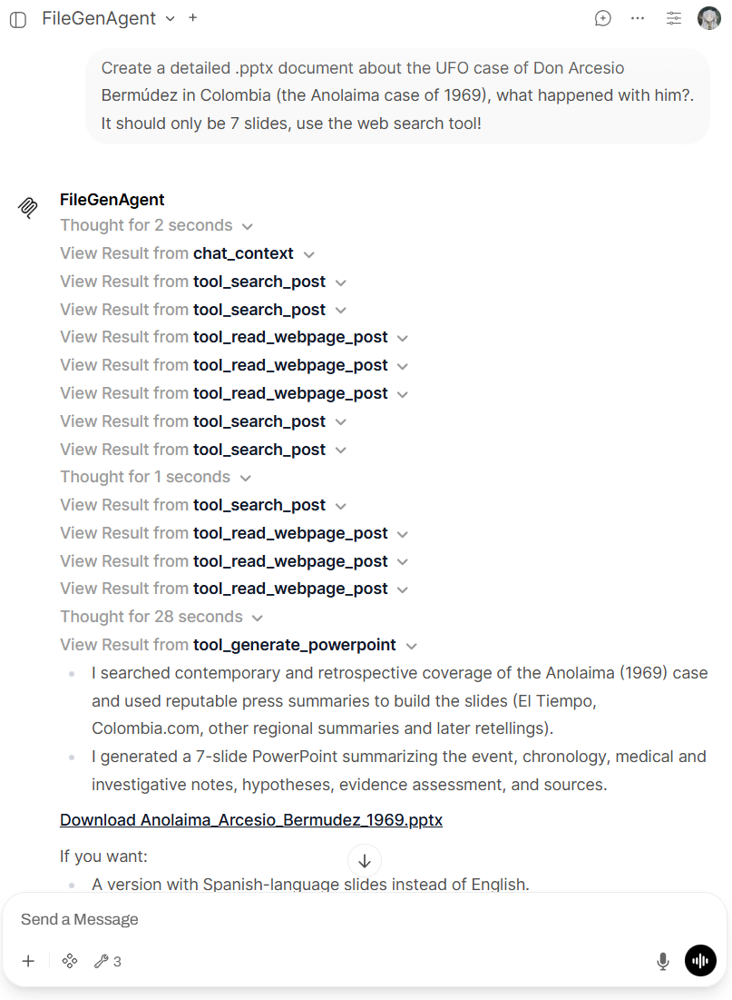
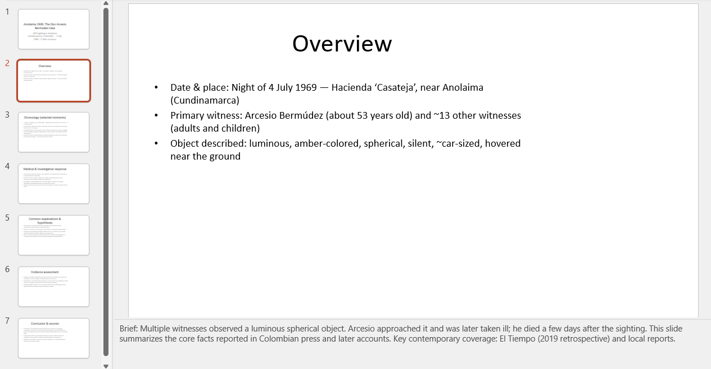

# GenFiles MCP Server 🧩

GenFiles is an MCP Server that generates PowerPoint, Excel, Word, or Markdown files from user requests and chat context. This server executes Python templates to produce files, uploads them to an Open Web UI (OWUI) endpoint, and stores them in the user's personal knowledge base. Additionally, it supports analyzing and reviewing existing Word documents by extracting their structure and adding comments for corrections, grammar suggestions, or idea enhancements.

## Table of Contents

- [Features](#features)
- [Status](#status)
- [Prerequisites](#prerequisites)
- [Installation](#installation)
  - [Option 1: Using Pre-built Docker Image (Recommended)](#option-1-using-pre-built-docker-image-recommended)
  - [Option 2: Building from Source](#option-2-building-from-source)
  - [Option 3: Docker Compose](#option-3-docker-compose)
- [Configuration](#configuration)
  - [Environment Variables](#environment-variables)
  - [MCP Server Configuration in Open Web UI](#mcp-server-configuration-in-open-web-ui)
- [Setup for Document Generation and Review Features](#setup-for-document-generation-and-review-features)
  - [Knowledge Base and Permissions](#knowledge-base-and-permissions)
  - [MCP Server Document Upload Settings](#mcp-server-document-upload-settings)
  - [System Prompt for your AI Assistant](#system-prompt-for-your-ai-assistant)
- [Usage Examples](#usage-examples)
  - [Example 1: Generating a DOCX file](#example-1-generating-a-docx-file)
  - [Example 2: Generating a XLSX file](#example-2-generating-a-xlsx-file)
  - [Example 3: Generating a PPTX file](#example-3-generating-a-pptx-file)
  - [Example 4: Reviewing a DOCX file with comments](#example-4-reviewing-a-docx-file-with-comments)
- [Star History](#star-history)

## Features

- **File Generation**: Creates files in multiple formats (PowerPoint, Excel, Word, Markdown) from user requests.
- **MCP Server**: Exposes tools via the Model Context Protocol for seamless integration with LLMs.
- **Python Templates**: Uses customizable Python templates to generate files with specific structures.
- **OWUI Integration**: Automatically uploads generated files to Open Web UI's file API (`/api/v1/files/`) and (`/api/v1/knowledge/`).
- **Document Review**: Analyzes existing Word documents and adds structured comments for corrections, grammar suggestions, or idea enhancements.
- **Image Embedding**: Supports embedding images from chat uploads directly into generated Word documents.
- **Knowledge Base Integration**: Generated and reviewed documents are automatically stored in the user's personal knowledge base, allowing easy access, download, and deletion.
- **Multi-User Support**: Designed for environments with multiple users, with user-specific document collections.

## Status

This release is **v0.3.0-alpha.5** and was tested with Open Web UI v0.8.1: [Open Web UI GitHub Repository](https://github.com/open-webui/open-webui)

**Important compatibility note:** this alpha requires **Open Web UI v0.6.42 or later** (the knowledge API changed to a paginated `/api/v1/knowledge/search` endpoint). For Open Web UI versions earlier than v0.6.42, use previous GenFiles releases **<= 0.2.2**. In recent versions of Open Web UI you could use GenFiles MCP Server v0.3.0-alpha.5 with limited functionality (without knowledge base integration) by setting `ENABLE_CREATE_KNOWLEDGE=false` 🚨 

**This MCP server requires Open Web UI v0.6.31 or later for native MCP support** 

The `ENABLE_CREATE_KNOWLEDGE` variable lets deployments choose whether generated or reviewed files are automatically added to users' knowledge collections. The original behavior (downloading files from chats) remains unchanged for end users.

## Prerequisites

- **Docker** installed on your system
- Administrators must enable "Knowledge Access" permission in Workspace Permissions for default or group user permissions
- This alpha runs as an MCP Server using `streamable-http` transport.

## Installation

### Option 1: Using Pre-built Docker Image (Recommended)

Pull the pre-built Docker image from GitHub Container Registry:

```bash
docker pull ghcr.io/baronco/genfilesmcp:v0.3.0-alpha.5
```

Run the container:

```bash
docker run -d --restart unless-stopped -p YOUR_PORT:YOUR_PORT \
  -e OWUI_URL="http://host.docker.internal:3000" \
  -e PORT=YOUR_PORT \
  -e REVIEWER_AI_ASSISTANT_NAME="GenFilesMCP" \
  -e ENABLE_CREATE_KNOWLEDGE=false \
  --name gen_files_mcp \
  ghcr.io/baronco/genfilesmcp:v0.3.0-alpha.5
```

One-line command (copy/paste):

```bash
docker run -d --restart unless-stopped -p 8016:8016 -e OWUI_URL="http://host.docker.internal:3000" -e PORT=8016 -e REVIEWER_AI_ASSISTANT_NAME="GenFilesMCP" -e ENABLE_CREATE_KNOWLEDGE=false --name gen_files_mcp ghcr.io/baronco/genfilesmcp:v0.3.0-alpha.5
```

Alternatively, use the `:latest` tag for the most recent version:

```bash
docker run -d --restart unless-stopped -p YOUR_PORT:YOUR_PORT \
  -e OWUI_URL="http://host.docker.internal:3000" \
  -e PORT=YOUR_PORT \
  -e REVIEWER_AI_ASSISTANT_NAME="GenFilesMCP" \
  -e ENABLE_CREATE_KNOWLEDGE=false \
  --name gen_files_mcp \
  ghcr.io/baronco/genfilesmcp:latest
```

One-line command (copy/paste):

```bash
docker run -d --restart unless-stopped -p 8016:8016 -e OWUI_URL="http://host.docker.internal:3000" -e PORT=8016 -e REVIEWER_AI_ASSISTANT_NAME="GenFilesMCP" -e ENABLE_CREATE_KNOWLEDGE=false --name gen_files_mcp ghcr.io/baronco/genfilesmcp:latest
```

### Option 2: Building from Source

If you need to build the image yourself:

1. Clone the repository:

```bash
git clone https://github.com/Baronco/GenFilesMCP.git
cd GenFilesMCP
```

2. Build the Docker image:

```bash
docker build -t gen_files_mcp .
```

3. Run the container:

```bash
docker run -d --restart unless-stopped \
  -p YOUR_PORT:YOUR_PORT \
  -e OWUI_URL="http://host.docker.internal:3000" \
  -e PORT=YOUR_PORT \
  -e REVIEWER_AI_ASSISTANT_NAME="GenFilesMCP" \
  -e ENABLE_CREATE_KNOWLEDGE=false \
  --name gen_files_mcp \
  gen_files_mcp
```

### Option 3: Docker Compose
 
If you want to build the image yourself (you have the Dockerfile and local dependencies):

- Clone the repository


```shell
git clone https://github.com/Baronco/GenFilesMCP.git
cd GenFilesMCP
```

- Use the docker-compose.yml:


```yaml
services:
  genfiles-mcp:
    build:
      context: .
      dockerfile: Dockerfile
    container_name: gen_files_mcp
    environment:
      - REVIEWER_AI_ASSISTANT_NAME=GenFilesMCP
      - ENABLE_CREATE_KNOWLEDGE=false
      - OWUI_URL=http://open-webui:8080
      - PORT=8016
```

If you only want to use the image published on GitHub, modify the docker-compose.yml:

```yaml
services:
  genfiles-mcp:
    image: ghcr.io/baronco/genfilesmcp:latest
    container_name: gen_files_mcp
    environment:
      - REVIEWER_AI_ASSISTANT_NAME=GenFilesMCP
      - ENABLE_CREATE_KNOWLEDGE=false
      - OWUI_URL=http://open-webui:8080
      - PORT=8016
```

Finally, run the Docker Compose setup:

```shell
docker compose up -d
```

## Configuration

### Environment Variables

The MCP Server requires the following environment variables:

| Variable | Description | Example |
|----------|-------------|---------|
| `OWUI_URL` | URL of your Open Web UI instance | `http://host.docker.internal:3000` |
| `PORT` | Port where the MCP Server will listen | `8016` |
| `REVIEWER_AI_ASSISTANT_NAME` | Default assistant name used when adding review comments in DOCX files. | `GenFilesMCP` |
| `ENABLE_CREATE_KNOWLEDGE` | Controls whether generated or reviewed files are automatically added to users' knowledge collections. Set to `true` to enable automatic creation/updating of knowledge collections; set to `false` to disable that behavior. | `false` |

### MCP Server Configuration in Open Web UI

**Important:** This alpha release requires **Open Web UI version v0.6.42 or later** for native support due to a change in the knowledge API (now `/api/v1/knowledge/search`, paginated). For Open Web UI versions earlier than v0.6.42, use previous GenFiles releases **<= 0.2.2**.

Configure the server in your Open Web UI "External Tools" settings using MCP (`streamable-http`) and set:

> URL "http://host.docker.internal:8016/mcp"

<div style="text-align: center;">

  

</div>

> Once Tools are enabled for your model, Open WebUI gives you two different ways to let your LLM use them in conversations. You can decide how the model should call Tools by choosing between: `Default Mode (Prompt-based)` or `Native Mode (Built-in function calling)`, check the documentation for more details: [OWUI Tools](https://docs.openwebui.com/features/extensibility/plugin/tools/)

The recomended way to use the GenFiles MCP Server is with `Native Mode (Built-in function calling)` as it provides a more seamless experience and better integration with the LLM's capabilities.

## Setup for Document Generation and Review Features

These features require additional setup in Open Web UI:

### Prerequisites

1. Create a mandatory custom tool called `chat_context` in Open Web UI to retrieve file metadata

### Creating the chat_context Tool

1. In Open Web UI, go to **Workspace > Tools > (+) Create**
2. Paste the following code:

```python
import os
import requests
from datetime import datetime
from pydantic import BaseModel, Field


class Tools:
    def __init__(self):
        pass

    # Add your custom tools using pure Python code here, make sure to add type hints and descriptions

    def chat_context(self, __files__: dict = {}, __metadata__: dict = {}) -> dict:
        """
        Get files metadata and get the user Email and user ID from the user object.
        """
        print(f"__metadata__ \n\n{__metadata__}")
        # id and name of current files
        chat_context = {"files": [], "attached_images": []}

        # files metadata
        if __files__:
            for f in __files__:
                chat_context["files"].append({"id": f["id"], "name": f["name"]})

        # imgs in messages
        parent = __metadata__.get("parent_message", {})
        files = parent.get("files", [])

        for f in files:
            content_type = f.get("content_type", "")
            file_id = f.get("id")
            filename = f.get("name")

            if content_type.startswith("image/"):
                chat_context["attached_images"].append(
                    {"img_id": file_id, "file_name": filename}
                )

        return chat_context
```
> Now `chat_context` is versioned as `chat_context.py` in the repository `OWUI tools\chat_context.py`

3. Save the tool as `chat_context`

<div style="text-align: center;">

  

</div>

**Note:** This tool is mandatory for the correct functioning of document generation and review features, as it provides the necessary chat context, including file metadata and attached images.

### Knowledge Base and Permissions

This version integrates with Open Web UI's knowledge base system:

- **Permission Requirement**: Administrators must enable the "Knowledge Access" permission in Workspace Permissions for default or group user permissions: -> Admin Panel -> Users -> Groups -> Default permissions (or other Group). 

<div style="text-align: center;">

  

</div>

- **User Collections**: Each user will have two dedicated knowledge collections created automatically:
  - "My Generated Files": Contains all documents generated by the user.
  - "Documents Reviewed by AI": Contains all Word documents reviewed and commented on by the AI.
- **Document Management**: Users can easily review, access, download, and delete their generated or reviewed documents from their knowledge base. Deleting a document from the knowledge base also removes it from the chats where it was generated.

<div style="text-align: center;">


</div>

### MCP Server Document Upload Settings

Behavior summary:
- If `ENABLE_CREATE_KNOWLEDGE=false`: The MCP Server will NOT create or update knowledge collections for generated/reviewed files. 
- If `ENABLE_CREATE_KNOWLEDGE=true`: The MCP Server will create/update per-user knowledge collections for generated/reviewed files.

## System Prompt for your AI Assistant

For optimal results, create a custom agent in Open Web UI:

1. Create a new agent called **AI Assistant**
2. Use this system prompt for the agent `example/systemprompt.md`
3. Set temperature to `0.5` for balanced creativity and accuracy
4. Enable Tools for the agent and select the GenFiles MCP Server, making sure to choose `Native Mode (Built-in function calling)` for better integration.

## Usage Examples

### Example 1: Generating a DOCX file

This new alpha version v0.3.0-alpha.5 includes improved DOCX generation capabilities for enhancing safety and robustness. Now AI assistants have to focus in the elements required for the document structure and not in the generation of the document using code blocks.

<div style="text-align: center;">

  

</div>

This new version can include images embedded directly into the generated Word document, sourced from chat uploads. This allows for richer, visual content in the documents without relying on external links.

<div style="text-align: center;">

  

</div>

Your assistant can generate documents with one column or two columns for academic papers.

You can find results like this in the `example\DOCX` folder of the repository. Each document was exported manually as .pdf to be able to view the results in github, but you can find the original .docx files in the same folder.

#### Results Summary 📊

Scoring scale: `1 = full star`, `0.5 = half star`, `0 = empty star`.

Criteria (brief):
- **C1 Image Use**: correct and meaningful integration of provided images.
- **C2 Structure**: logical flow and coherence.
- **C3 Word Elements**: good use of title/sections/tables/lists/images/formatting.
- **C4 Depth**: ability to develop the topic with complete, well-elaborated paragraphs (not short, shallow ones).
- **C5 First-Try Success**: generated successfully on first attempt.

##### Models that support images

| Model | C1 | C2 | C3 | C4 | C5 | Total | Stars |
|---|---:|---:|---:|---:|---:|---:|---|
| GPT 4.1 mini | 0 | 1 | 0.5 | 0.5 | 1 | 3.0 | ★★★☆☆ |
| GPT 5.1 mini | 0.5 | 0.5 | 1 | 0.5 | 1 | 3.5 | ★★★⯪☆ |
| GPT 5.1 Codex mini | 0.5 | 1 | 0.5 | 1 | 1 | 4.0 | ★★★★☆ |
| GPT 5.2 | 1 | 1 | 0.5 | 1 | 1 | 4.5 | ★★★★⯪ |
| Claude 3 Haiku | 0 | 1 | 0.5 | 0.5 | 1 | 3.0 | ★★★☆☆ |
| Claude Haiku 4.5 | 1 | 1 | 1 | 1 | 1 | 5.0 | ★★★★★ |
| Google Gemini 3 Flash Preview | 0.5 | 1 | 1 | 1 | 0 | 3.5 | ★★★⯪☆ |
| Gemini 3 Pro Preview | 0 | 0 | 0 | 0 | 0 | 0.0 | ☆☆☆☆☆ |
| Grok Code 4.1 Fast | 1 | 1 | 0.5 | 0.5 | 1 | 4.0 | ★★★★☆ |
| Kimi K2.5 | 1 | 1 | 1 | 1 | 1 | 5.0 | ★★★★★ |
| Mistral 14B 2512 | 0 | 0 | 0 | 0 | 0 | 0.0 | ☆☆☆☆☆ |
| Qwen3 VL 8B Thinking | 0.5 | 0.5 | 1 | 0 | 1 | 3.0 | ★★★☆☆ |

##### Models that do not support images

| Model | C1 | C2 | C3 | C4 | C5 | Total | Stars |
|---|---:|---:|---:|---:|---:|---:|---|
| Grok Code Fast 1 | N/A | 1 | 1 | 1 | 1 | 4.0 | ★★★★☆ |
| DeepSeek V3.1 Terminus | N/A | 1 | 1 | 1 | 1 | 4.0 | ★★★★☆ |


- 🏆 **Best overall**: Claude Haiku 4.5 and Kimi K2.5 (5.0/5).
- ✅ **Acceptable performance (4.0 to <5.0)**: GPT 5.2 (4.5), GPT 5.1 Codex mini (4.0), Grok Code 4.1 Fast (4.0), Grok Code Fast 1 (4.0), DeepSeek V3.1 Terminus (4.0).
- ⚠️ **Weakest results**: Gemini 3 Pro Preview (0.0) and Mistral 14B 2512 (0.0).
- ℹ️ In this evaluation, **C1 = 0** means the model failed to call the tool needed to identify attached images.
- 🔎 Content factuality, hallucinations, and technical correctness were **not** evaluated here, because this benchmark focuses on structure, tool use, and first-pass execution; users must validate factual quality independently.


> If your model does not have vision capabilities do not attach images in the chat, as the agent will not be able to see them and include them in the document.

### Example 2: Generating a XLSX file


<div style="text-align: center;">

  

</div>

Open the generated file in Excel:

<div style="text-align: center;">

  

</div>

> **Example files**: You can find example XLSX files in the `example` folder.

### Example 3: Generating a PPTX file

In this example, another MCP server was used for web research and GenFiles MCP Server was used to generate a PowerPoint presentation:

<div style="text-align: center;">

  

</div>

Open the generated file in PowerPoint:

<div style="text-align: center;">

  

</div>

> **Example files**: You can find example PPTX files in the `example` folder.

### Example 4: Reviewing a DOCX file with comments

The review feature allows the agent to analyze uploaded documents and add structured comments for improvements.

<div style="text-align: center;">

  

</div>

<div style="text-align: center;">

  

</div>

**Workflow:**
1. User uploads `History_of_Neural_Nets_Summary.docx` to the chat
2. User requests a review with comments for corrections, grammar suggestions, and idea enhancements
3. Agent calls the `chat_context` custom tool to retrieve file ID and name
4. Agent uses the `list_docx_elements` tool to analyze the document structure
5. Agent calls the `review_docx` tool to add comments to specific elements

**Result:**

<div style="text-align: center;">

  

</div>

> **Example files**: Find the reviewed document in the `example` folder: `History_of_Neural_Nets_Summary_69d1751b-577b-4329-beca-ac16db7acdbd_reviewed.docx`

> Generated using the GenFiles MCP Server and GPT-5 mini

> The review functionality preserves the original formatting while adding structured comments

## Star History

[](https://www.star-history.com/#Baronco/GenFilesMCP&type=date&legend=top-left)

## License

This project is licensed under the MIT License - see the [LICENSE.md](LICENSE.md) file for details.
