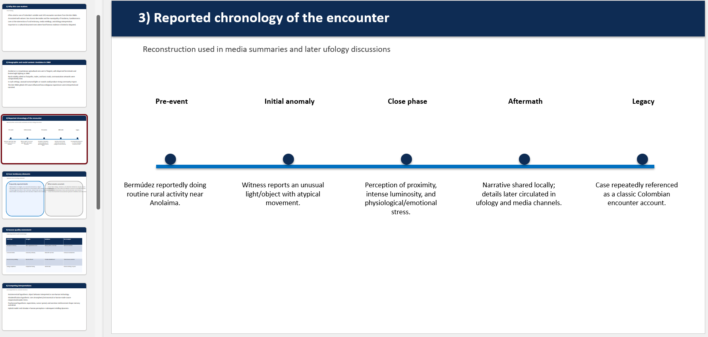
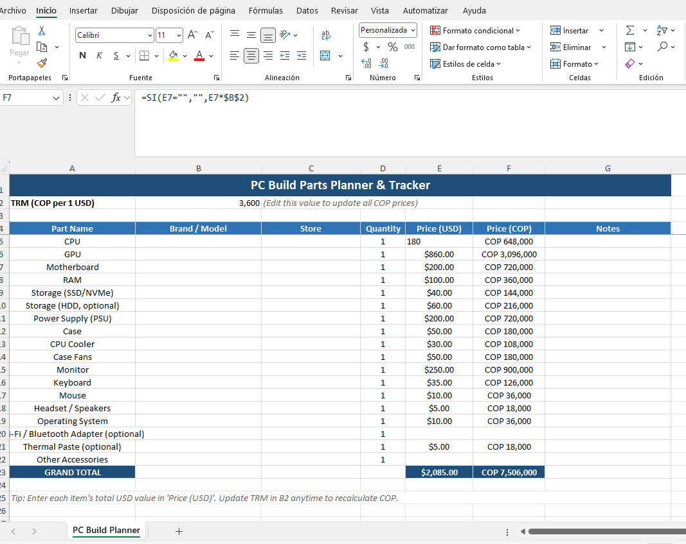

# GenFiles MCP Server 🧩

GenFiles is an MCP Server that generates PowerPoint, Excel, Word, or Markdown files from user requests and chat context. This server executes Python templates or structured document builders to produce files, uploads them to an Open Web UI (OWUI) endpoint, and can persist them in Open WebUI knowledge collections depending on the selected transport and configuration. Additionally, it supports analyzing and reviewing existing Word documents by extracting their structure and adding comments for corrections, grammar suggestions, or idea enhancements.

## Table of Contents

- [Features](docs/features.md) ✨
  - Highlights the key capabilities of GenFiles MCP Server.
  - Learn about file generation, OWUI integration, and more.
- [Installation](docs/installation.md) ⚙️
  - Two deployment modes:
    - **MCP HTTP Streamable**: Direct HTTP service.
    - **MCP Stdio via MCPO**: Integrated with MCPO.
  - Get the suggested system prompt for your AI Assistant
  - Get the built-in tool `Chat Context Tool` for retrieving docx files and images uploaded in the chat for use in generation or review.
  - Step-by-step setup instructions.
- [Usage Examples](docs/usage.md) 📄
  - See how to generate DOCX, XLSX, PPTX files.
  - Learn how to review Word documents with AI comments.

> 🚨 Please follow the installation instructions step by step to avoid errors.

## Quick Start (MCP HTTP Streamable) [Installation Guide](docs/installation.md).

### Installation

To quickly get started, you can use the pre-built Docker image:

```bash
docker pull ghcr.io/baronco/genfilesmcp:v0.3.0
```

Run the container:

```bash
docker run -d --restart unless-stopped -p 8016:8016 \
  -e OWUI_URL="http://host.docker.internal:3000" \
  -e PORT=8016 \
  -e REVIEWER_AI_ASSISTANT_NAME="GenFilesMCP" \
  -e ENABLE_CREATE_KNOWLEDGE=false \
  --name gen_files_mcp \
  ghcr.io/baronco/genfilesmcp:v0.3.0
```

Or copy and paste this one-liner:

```bash
docker run -d --restart unless-stopped -p 8016:8016 -e OWUI_URL="http://host.docker.internal:3000" -e PORT=8016 -e REVIEWER_AI_ASSISTANT_NAME="GenFilesMCP" -e ENABLE_CREATE_KNOWLEDGE=false --name gen_files_mcp ghcr.io/baronco/genfilesmcp:v0.3.0
```

### Environment Variables

| Variable                     | Description                                                                 | Example                                 |
|------------------------------|-----------------------------------------------------------------------------|-----------------------------------------|
| `OWUI_URL`                   | URL of your Open Web UI instance                                            | `http://host.docker.internal:3000`      |
| `PORT`                       | Port where the MCP Server will listen                                       | `8016`                                  |
| `MCP_TRANSPORT`              | MCP transport used at startup. Use `streamable-http` for direct HTTP deployments such as Open WebUI external tools, or `stdio` when the server is launched by MCPO or another stdio-capable MCP client. | `streamable-http` |
| `OWUI_API_KEY`               | API key used only for `stdio` deployments through MCPO, where Open WebUI cannot forward the active user's bearer token through the `Open WebUI -> MCPO -> stdio MCP` chain. Do not use it for direct `streamable-http` deployments. | `sk-017374a....`                                      |
| `KNOWLEDGE_COLLECTION_NAME`  | Name of the Open WebUI knowledge collection used for generated and reviewed files when `ENABLE_CREATE_KNOWLEDGE=true`. | `My Generated Files`                    |
| `REVIEWER_AI_ASSISTANT_NAME` | Author name used inside Word comments created by `review_docx`.             | `GenFilesMCP`                           |
| `ENABLE_CREATE_KNOWLEDGE`    | Controls whether generated or reviewed files are attached to Open WebUI knowledge collections. In direct `streamable-http` mode this is optional. In `stdio` through MCPO it must be `true`. | `false`                                 |
| `ENABLE_WORD_ELEMENT_FILLING`| Experimental DOCX mode. `false` keeps the code-generation flow; `true` switches to the structured element-based builder. | `false`                                 |

For more detailed installation instructions, see the [Installation Guide](docs/installation.md).

## What Can It Do?

- Generate files in multiple formats (PowerPoint, Excel, Word, Markdown).
- Review Word documents with AI-generated comments for grammar and idea enhancements.
- Integrate seamlessly with Open Web UI for file uploads and knowledge management.

### Examples of Generated Files 📄

#### DOCX Files 📝

- **Code-based generation**: The LLM writes Python code to generate the document.
- **Template-based generation**: The LLM defines the structure, and the backend builds the document (best results with Claude Haiku 4.5 and Kimi K2.5, 5.0/5).

<p align="center">
  
</p>

- **Reviewer Mode**: Add comments for grammar and idea enhancements.

<p align="center">
  
</p>

#### PPTX Files 📊

The latest GPT models can generate PowerPoint files with good structure and formatting. You can try gpt-5.2 or gpt-5.4 for best style and formatting results.

<p align="center">
  
</p>

Example using gpt 5.4:

<p align="center">
  
</p>

#### XLSX Files 📈

The server can generate Excel files with multiple sheets, tables, and charts. The quality of formatting and structure depends on the model used, with the latest GPT models producing the best results.

<p align="center">
  
</p>

Example using gpt 5.4:

<p align="center">
  
</p>

## Star History

[](https://www.star-history.com/#Baronco/GenFilesMCP&type=date&legend=top-left)

## License

This project is licensed under the MIT License - see the [LICENSE.md](LICENSE.md) file for details.
