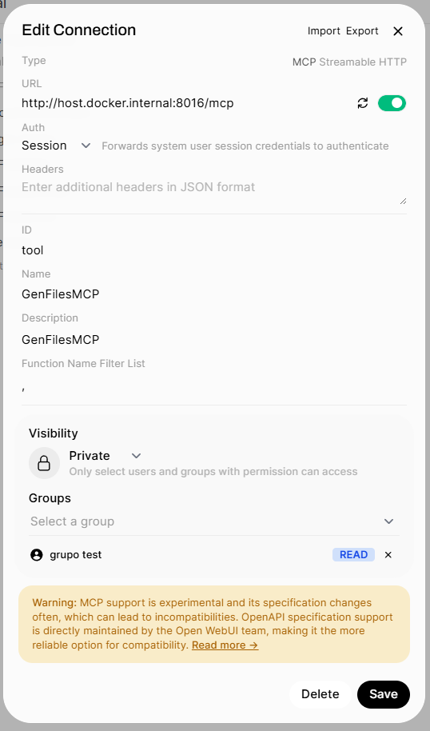
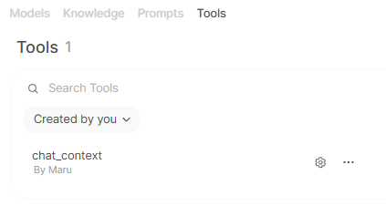
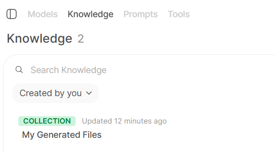
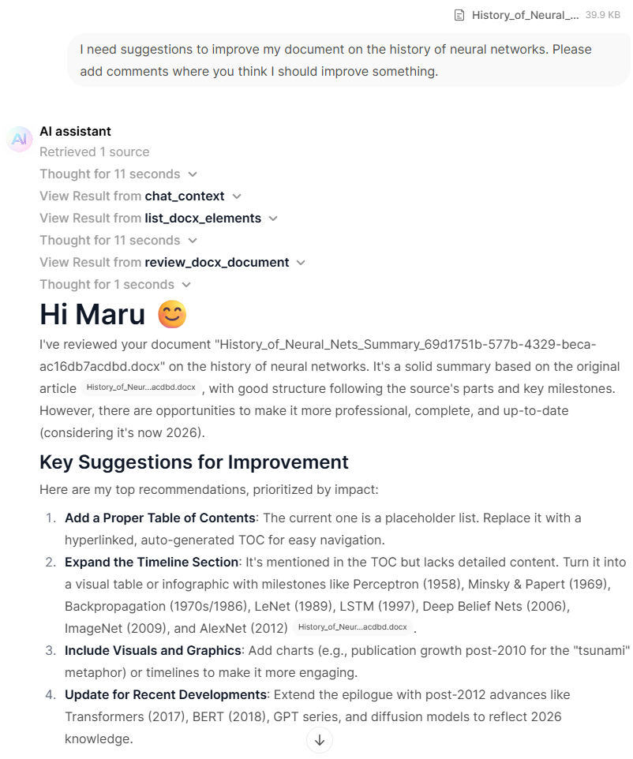
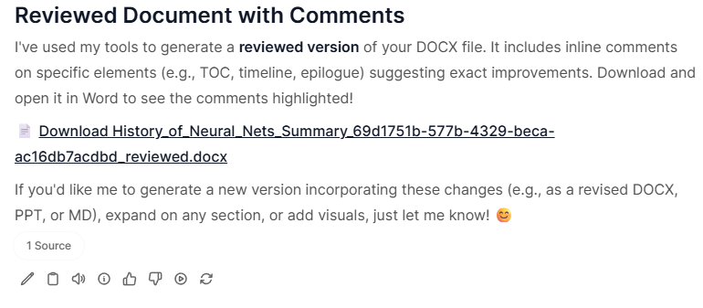

# GenFilesMCP 🧩

GenFilesMCP is a Model Context Protocol (MCP) server that generates PowerPoint, Excel, Word, or Markdown files from user requests and chat context. This MCP executes Python templates to produce files, uploads them to an Open Web UI (OWUI) endpoint, and stores them in the user's personal knowledge base. Additionally, it supports analyzing and reviewing existing Word documents by extracting their structure and adding comments for corrections, grammar suggestions, or idea enhancements.

## Table of Contents

- [Features](#features)
- [Status](#status)
- [Prerequisites](#prerequisites)
- [Installation](#installation)
  - [Option 1: Using Pre-built Docker Image (Recommended)](#option-1-using-pre-built-docker-image-recommended)
  - [Option 2: Building from Source](#option-2-building-from-source)
  - [Option 3: Docker Compose](#option-3-docker-compose)
- [Configuration](#configuration)
  - [Environment Variables](#environment-variables)
  - [MCP Configuration in Open Web UI](#mcp-configuration-in-open-web-ui)
- [Setup for Document Generation and Review Features](#setup-for-document-generation-and-review-features)
  - [Knowledge Base and Permissions](#knowledge-base-and-permissions)
  - [MCP Server Document Upload Settings](#mcp-server-document-upload-settings)
- [Usage Examples](#usage-examples)
  - [Example 1: Generating a DOCX file](#example-1-generating-a-docx-file)
  - [Example 2: Reviewing a DOCX file with comments](#example-2-reviewing-a-docx-file-with-comments)
- [Star History](#star-history)

## Features

- **File Generation**: Creates files in multiple formats (PowerPoint, Excel, Word, Markdown) from user requests.
- **FastMCP Server**: Receives and processes generation requests via a FastMCP server.
- **Python Templates**: Uses customizable Python templates to generate files with specific structures.
- **OWUI Integration**: Automatically uploads generated files to Open Web UI's file API (`/api/v1/files/`) and (`/api/v1/knowledge/`).
- **Document Review**: Analyzes existing Word documents and adds structured comments for corrections, grammar suggestions, or idea enhancements.
- **Knowledge Base Integration**: Generated and reviewed documents are automatically stored in the user's personal knowledge base, allowing easy access, download, and deletion.
- **Multi-User Support**: Designed for environments with multiple users, with user-specific document collections.

## Status

This release is **v0.2.1**. It introduces a new environment variable `ENABLE_CREATE_KNOWLEDGE` that lets deployments choose whether generated or reviewed files are automatically added to users' knowledge collections. This enables coexistence between RAG-preserving deployments (do not enable knowledge creation) and deployments that want generated files saved to knowledge collections (requires enabling the Open Web UI document option `Bypass Embedding and Retrieval`). The original behavior (downloading files from chats) remains unchanged for end users.

## Prerequisites

- **Docker** installed on your system
- **Open Web UI** instance running (v0.6.31 or later for native MCP support)
- Administrators must enable "Knowledge Access" permission in Workspace Permissions for default or group user permissions

## Installation

### Option 1: Using Pre-built Docker Image (Recommended)

Pull the pre-built Docker image from GitHub Container Registry:

```bash
docker pull ghcr.io/baronco/genfilesmcp:v0.2.1
```

Run the container:

```bash
docker run -d --restart unless-stopped -p YOUR_PORT:YOUR_PORT \
  -e OWUI_URL="http://host.docker.internal:3000" \
  -e PORT=YOUR_PORT \
  -e ENABLE_CREATE_KNOWLEDGE=false \
  --name gen_files_mcp \
  ghcr.io/baronco/genfilesmcp:v0.2.1
```

Alternatively, use the `:latest` tag for the most recent version:

```bash
docker run -d --restart unless-stopped -p YOUR_PORT:YOUR_PORT \
  -e OWUI_URL="http://host.docker.internal:3000" \
  -e PORT=YOUR_PORT \
  -e ENABLE_CREATE_KNOWLEDGE=false \
  --name gen_files_mcp \
  ghcr.io/baronco/genfilesmcp:latest
```

### Option 2: Building from Source

If you need to build the image yourself:

1. Clone the repository:

```bash
git clone https://github.com/Baronco/GenFilesMCP.git
cd GenFilesMCP
```

2. Build the Docker image:

```bash
docker build -t genfilesmcp .
```

3. Run the container:

```bash
docker run -d --restart unless-stopped \
  -p YOUR_PORT:YOUR_PORT \
  -e OWUI_URL="http://host.docker.internal:3000" \
  -e PORT=YOUR_PORT \
  -e ENABLE_CREATE_KNOWLEDGE=false \
  --name gen_files_mcp \
  genfilesmcp
```

### Option 3: Docker Compose
 
If you want to build the image yourself (you have the Dockerfile and local dependencies):

    * Clone the repository


```shell
git clone https://github.com/Baronco/GenFilesMCP.git
cd GenFilesMCP
```

    * Use the docker-compose.yml:


```yaml
services:
genfilesmcp:
    build:
    context: .
    dockerfile: Dockerfile
    container_name: genfilesmcp
    environment:
    - ENABLE_CREATE_KNOWLEDGE=false
    - OWUI_URL=http://open-webui:8080
    - PORT=8015
```

If you only want to use the image published on GitHub, modify the docker-compose.yml:

```yaml
services:
  genfilesmcp:
    image: ghcr.io/baronco/genfilesmcp:latest
    container_name: genfilesmcp
    environment:
      - ENABLE_CREATE_KNOWLEDGE=false
      - OWUI_URL=http://open-webui:8080
      - PORT=8015
```

Finally, run the Docker Compose setup:

```shell
docker compose up -d
```

## Configuration

### Environment Variables

The MCP server requires the following environment variables:

| Variable | Description | Example |
|----------|-------------|---------|
| `OWUI_URL` | URL of your Open Web UI instance | `http://host.docker.internal:3000` |
| `PORT` | Port where the MCP server will listen | `8015` |
| `ENABLE_CREATE_KNOWLEDGE` | Controls whether generated or reviewed files are automatically added to users' knowledge collections. Set to `true` to enable automatic creation/updating of knowledge collections; set to `false` to disable that behavior and preserve RAG workflows (recommended default for RAG users). NOTE: If `ENABLE_CREATE_KNOWLEDGE=true`, it is mandatory to enable the Open Web UI document option `Bypass Embedding and Retrieval`. | `false` |

### MCP Configuration in Open Web UI

**Important:** This version requires **Open Web UI version v0.6.31 or later** for native MCP support. MCPO is no longer supported.

Configure the MCP directly in your Open Web UI "External Tools" settings. Set the type to "MCP Streamable HTTP" and Auth to "Session".

When using docker-compose set URL to "http://genfilesmcp:8015/mcp"

<div style="text-align: center;">

  

</div>

> Once Tools are enabled for your model, Open WebUI gives you two different ways to let your LLM use them in conversations. You can decide how the model should call Tools by choosing between: `Default Mode (Prompt-based)` or `Native Mode (Built-in function calling)`, check the documentation for more details: [OWUI Tools](https://docs.openwebui.com/features/plugin/tools/)

## Setup for Document Generation and Review Features

These features require additional setup in Open Web UI:

### Prerequisites

1. Create a mandatory custom tool called `chat_context` in Open Web UI to retrieve user and file metadata

### Creating the chat_context Tool

1. In Open Web UI, go to **Workspace > Tools > (+) Create**
2. Paste the following code:

```python
import os
import requests
from datetime import datetime
from pydantic import BaseModel, Field


class Tools:
    def __init__(self):
        pass

    # Add your custom tools using pure Python code here, make sure to add type hints and descriptions

    def chat_context(self, __files__: dict = {}, __user__: dict = {}) -> dict:
        """
        Get files metadata and get the user Email and user ID from the user object.
        """
        # id and name of current files
        chat_context = {"files": [], "user_id": None, "user_email": None}

        # user data
        if "id" in __user__:
            chat_context["user_id"] = __user__["id"]
        if "email" in __user__:
            chat_context["user_email"] = __user__["email"]
        if chat_context["user_id"] is None:
            chat_context = {"error": "User: Unknown"}

        # files metadata
        if __files__:
            for f in __files__:
                chat_context["files"].append({"id": f["id"], "name": f["name"]})
            return chat_context
        else:
            return chat_context
```

3. Save the tool as `chat_context`

<div style="text-align: center;">

  

</div>

**Note:** This tool is mandatory for the correct functioning of document generation and review features, as it provides the necessary user context (user_id) for storing documents in the user's knowledge base.

### Knowledge Base and Permissions

This version integrates with Open Web UI's knowledge base system:

- **Permission Requirement**: Administrators must enable the "Knowledge Access" permission in Workspace Permissions for default or group user permissions: -> Admin Panel -> Users -> Groups -> Default permissisons (or other Group). 

<div style="text-align: center;">

  

</div>

- **User Collections**: Each user will have two dedicated knowledge collections created automatically:
  - "My Generated Files": Contains all documents generated by the user.
  - "Documents Reviewed by AI": Contains all Word documents reviewed and commented on by the AI.
- **Document Management**: Users can easily review, access, download, and delete their generated or reviewed documents from their knowledge base. Deleting a document from the knowledge base also removes it from the chats where it was generated.

<div style="text-align: center;">



</div>

### MCP Server Document Upload Settings

To support automatic creation of knowledge collections for files generated or reviewed by the MCP server, the Open Web UI document option `Bypass Embedding and Retrieval` must be enabled. This is required only when `ENABLE_CREATE_KNOWLEDGE=true`.

Behavior summary:
- If `ENABLE_CREATE_KNOWLEDGE=false` (default recommended for RAG users): The MCP server will NOT create or update knowledge collections for generated/reviewed files. Users who rely on RAG or do not want knowledge collections created can keep this setting disabled and do NOT enable `Bypass Embedding and Retrieval`. Users will still be able to download generated/reviewed files from their chats as before.
- If `ENABLE_CREATE_KNOWLEDGE=true`: The MCP server will attempt to create/update per-user knowledge collections for generated/reviewed files. In this mode, you MUST enable `Bypass Embedding and Retrieval` in the Open Web UI document options so the knowledge creation/upload flow works correctly.

<div style="text-align: center;">

  

</div>

## System Prompt for FileGenAgent

For optimal results, create a custom agent in Open Web UI:
1. Copy the system prompt from `example/systemprompt.md`
2. Create a new agent called **FileGenAgent**
3. Use this system prompt for the agent
4. Tested successfully with **GPT-5 Thinking mini**

## Usage Examples

### Example 1: Generating a DOCX file

<div style="text-align: center;">

  

</div>

> **Example files**: You can find the prompt and generated result in the `example` folder: `History_of_Neural_Nets_Summary_69d1751b-577b-4329-beca-ac16db7acdbd.docx`

> This file was generated using the GenFiles MCP server and GPT-5 mini

### Example 2: Reviewing a DOCX file with comments

The review feature allows the agent to analyze uploaded documents and add structured comments for improvements.

<div style="text-align: center;">

  

</div>

<div style="text-align: center;">

  

</div>

<div style="text-align: center;">

  

</div>

**Workflow:**
1. User uploads `History_of_Neural_Nets_Summary.docx` to the chat
2. User requests a review with comments for corrections, grammar suggestions, and idea enhancements
3. Agent calls the `get_files_metadata` custom tool to retrieve file ID and name
4. Agent uses the `full_context_docx` MCP function to analyze the document structure
5. Agent calls the `review_docx` MCP function to add comments to specific elements

**Result:**

<div style="text-align: center;">

  

</div>

> **Example files**: Find the reviewed document in the `example` folder: `History_of_Neural_Nets_Summary_reviewed_a35adcc5-e338-47c6-a0b0-2c21602b0777.docx`

> Generated using the GenFiles MCP server and GPT-5 mini

> The review functionality preserves the original formatting while adding structured comments

## Star History

[](https://www.star-history.com/#Baronco/GenFilesMCP&type=date&legend=top-left)
