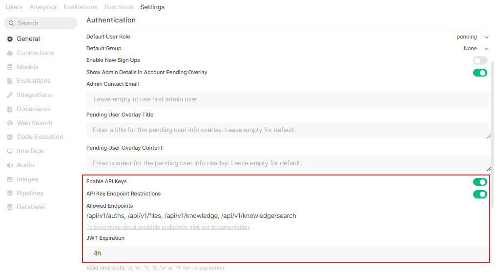
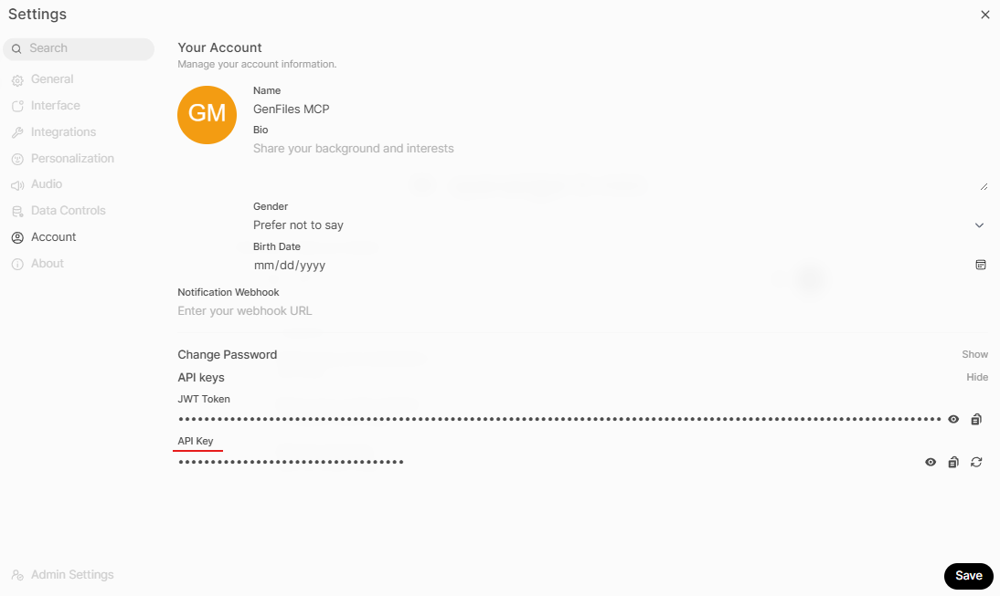
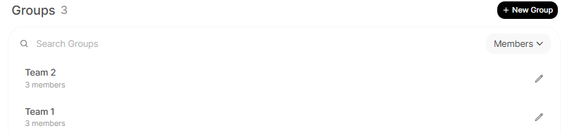
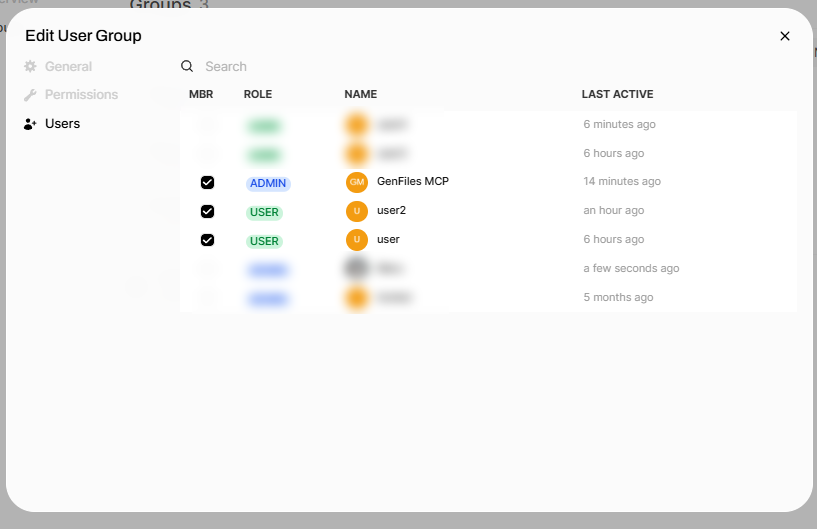
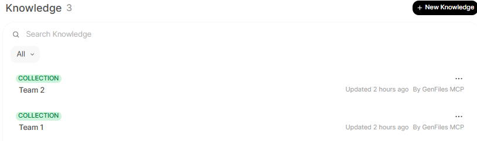
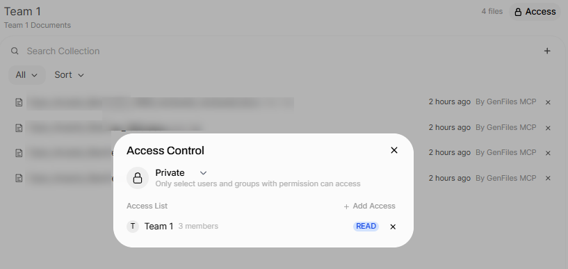
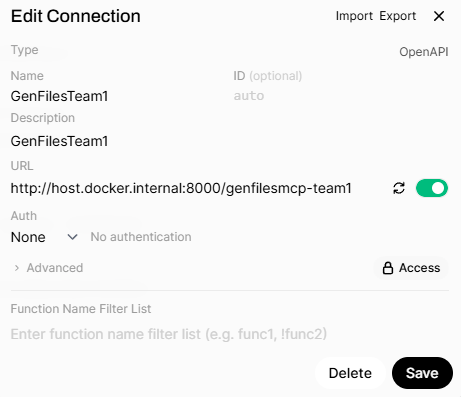

## Table of Contents

- [Choose Your Deployment Mode](#choose-your-deployment-mode)
- [Direct streamable-http](#direct-streamable-http)
  - [Deployment Prerequisites](#deployment-prerequisites)
  - [Installation](#installation)
  - [Open WebUI API Configuration](#open-webui-api-configuration)
  - [MCP Server Configuration in Open Web UI](#mcp-server-configuration-in-open-web-ui)
- [stdio through MCPO](#stdio-through-mcpo)
  - [Open WebUI API Restrictions](#open-webui-api-restrictions)
  - [MCPO Configuration with Config JSON](#mcpo-configuration-with-config-json)
  - [MCP Server Configuration in Open Web UI for stdio through MCPO](#mcp-server-configuration-in-open-web-ui-for-stdio-through-mcpo)
- [Shared Open WebUI Requirements](#shared-open-webui-requirements)
  - [Environment Variables](#environment-variables)
  - [Knowledge Base and Permissions](#knowledge-base-and-permissions)
  - [MCP Server Document Upload Settings](#mcp-server-document-upload-settings)
- [Document Generation and Review Setup](#document-generation-and-review-setup)
  - [Feature Prerequisites](#feature-prerequisites)
  - [Creating the Chat Context Tool](#creating-the-chat-context-tool)
  - [System Prompt for your AI Assistant](#system-prompt-for-your-ai-assistant)

## Choose Your Deployment Mode

Choose one of these two supported deployment patterns before you start configuring Open Web UI:

- **Direct streamable-http**: Recommended for single-user setups, whether local or cloud-hosted, when it is not a problem to deploy GenFilesMCP as its own HTTP web app or container.
- **stdio through MCPO**: Recommended when you already have [mcpo](https://github.com/open-webui/mcpo) deployed and want to reuse that same web app instead of deploying GenFilesMCP as another dedicated HTTP service. This is especially useful for multi-user environments.

The sections below keep the same technical details as before, but grouped first by deployment mode and then by shared Open Web UI requirements.

## Direct streamable-http

Use this mode when GenFilesMCP will run as its own HTTP MCP server and Open Web UI can call it directly.

### Deployment Prerequisites

- **Docker** installed on your system
- This mode runs GenFilesMCP as a dedicated HTTP service with `MCP_TRANSPORT=streamable-http`.

### Installation

### Option 1: Using Pre-built Docker Image (Recommended)

Pull the pre-built Docker image from GitHub Container Registry:

```bash
docker pull ghcr.io/baronco/genfilesmcp:v0.3.0
```

Run the container:

```bash
docker run -d --restart unless-stopped -p YOUR_PORT:YOUR_PORT \
  -e OWUI_URL="http://host.docker.internal:3000" \
  -e PORT=YOUR_PORT \
  -e REVIEWER_AI_ASSISTANT_NAME="GenFilesMCP" \
  -e ENABLE_CREATE_KNOWLEDGE=false \
  --name gen_files_mcp \
  ghcr.io/baronco/genfilesmcp:v0.3.0
```

One-line command (copy/paste):

```bash
docker run -d --restart unless-stopped -p 8016:8016 -e OWUI_URL="http://host.docker.internal:3000" -e PORT=8016 -e REVIEWER_AI_ASSISTANT_NAME="GenFilesMCP" -e ENABLE_CREATE_KNOWLEDGE=false --name gen_files_mcp ghcr.io/baronco/genfilesmcp:v0.3.0
```

Alternatively, use the `:latest` tag for the most recent version:

```bash
docker run -d --restart unless-stopped -p YOUR_PORT:YOUR_PORT \
  -e OWUI_URL="http://host.docker.internal:3000" \
  -e PORT=YOUR_PORT \
  -e REVIEWER_AI_ASSISTANT_NAME="GenFilesMCP" \
  -e ENABLE_CREATE_KNOWLEDGE=false \
  --name gen_files_mcp \
  ghcr.io/baronco/genfilesmcp:latest
```

One-line command (copy/paste):

```bash
docker run -d --restart unless-stopped -p 8016:8016 -e OWUI_URL="http://host.docker.internal:3000" -e PORT=8016 -e REVIEWER_AI_ASSISTANT_NAME="GenFilesMCP" -e ENABLE_CREATE_KNOWLEDGE=false --name gen_files_mcp ghcr.io/baronco/genfilesmcp:latest
```

These minimal examples keep knowledge persistence disabled. Add `KNOWLEDGE_COLLECTION_NAME` only if you change `ENABLE_CREATE_KNOWLEDGE` to `true`.

### Option 2: Building from Source

If you need to build the image yourself:

1. Clone the repository:

```bash
git clone https://github.com/Baronco/GenFilesMCP.git
cd GenFilesMCP
```

2. Build the Docker image:

```bash
docker build -t gen_files_mcp .
```

3. Run the container:

```bash
docker run -d --restart unless-stopped \
  -p YOUR_PORT:YOUR_PORT \
  -e OWUI_URL="http://host.docker.internal:3000" \
  -e PORT=YOUR_PORT \
  -e REVIEWER_AI_ASSISTANT_NAME="GenFilesMCP" \
  -e ENABLE_CREATE_KNOWLEDGE=false \
  --name gen_files_mcp \
  gen_files_mcp
```

### Option 3: Docker Compose
 
If you want to build the image yourself (you have the Dockerfile and local dependencies):

- Clone the repository


```shell
git clone https://github.com/Baronco/GenFilesMCP.git
cd GenFilesMCP
```

- Use the docker-compose.yml:


```yaml
services:
  genfiles-mcp:
    build:
      context: .
      dockerfile: Dockerfile
    container_name: gen_files_mcp
    environment:
      - REVIEWER_AI_ASSISTANT_NAME=GenFilesMCP
      - ENABLE_CREATE_KNOWLEDGE=false
      - OWUI_URL=http://open-webui:8080
      - PORT=8016
```

If you only want to use the image published on GitHub, modify the docker-compose.yml:

```yaml
services:
  genfiles-mcp:
    image: ghcr.io/baronco/genfilesmcp:latest
    container_name: gen_files_mcp
    environment:
      - REVIEWER_AI_ASSISTANT_NAME=GenFilesMCP
      - ENABLE_CREATE_KNOWLEDGE=false
      - OWUI_URL=http://open-webui:8080
      - PORT=8016
```

Finally, run the Docker Compose setup:

```shell
docker compose up -d
```

### Open WebUI API Configuration

- Set `JWT Expiration` to a finite duration such as `4h`. Do not leave it at `-1`.
- With a finite expiration, Open WebUI forwards the active session bearer token when the assistant calls the tool.
- That forwarded token lets GenFilesMCP work on behalf of the active user: upload generated files, download uploaded images or DOCX files, review documents, upload the reviewed document again, and return a download link the same user can open from the chat.
- In direct `streamable-http` mode, if `ENABLE_CREATE_KNOWLEDGE=true`, GenFilesMCP can create or update the active user's knowledge collection named `KNOWLEDGE_COLLECTION_NAME`, so manual collection creation is not required.
- In direct `streamable-http` mode, knowledge collections are optional. `ENABLE_CREATE_KNOWLEDGE=false` is supported.
- If `ENABLE_CREATE_KNOWLEDGE=false`, `KNOWLEDGE_COLLECTION_NAME` is ignored.
- Users who should access knowledge collections in direct `streamable-http` mode must have `Workspace Permissions -> Knowledge Access` enabled through default permissions or the relevant Open WebUI group.
- `OWUI_API_KEY` is not needed in direct `streamable-http` mode.

### MCP Server Configuration in Open Web UI

This section applies to direct `streamable-http` deployments.

**Important:** native MCP support appeared in **Open Web UI v0.6.31** and the paginated knowledge API used by this alpha arrived in **v0.6.42**, but because Open Web UI has changed significantly, the recommended minimum for this release is **v0.8.8**. For Open Web UI versions earlier than v0.6.42, use previous GenFiles releases **<= 0.2.2**.

Configure the server in your Open Web UI "External Tools" settings using MCP (`streamable-http`) and set:

> URL "http://host.docker.internal:8016/mcp"

<p align="center">
  
</p>

> Once Tools are enabled for your model, Open WebUI gives you two different ways to let your LLM use them in conversations. You can decide how the model should call Tools by choosing between: `Default Mode (Prompt-based)` or `Native Mode (Built-in function calling)`, check the documentation for more details: [OWUI Tools](https://docs.openwebui.com/features/extensibility/plugin/tools/)

The recommended way to use the GenFiles MCP Server is with `Native Mode (Built-in function calling)` as it provides a more seamless experience and better integration with the LLM's capabilities.

## stdio through MCPO

Use this mode when MCPO is already installed and running, and you want GenFilesMCP to be one more MCP entry inside that deployment instead of a separate HTTP service.

### Open WebUI API Restrictions

- Enable `Enable API Keys`.
- Enable `API Key Endpoint Restrictions`.
- Allow only these Open WebUI API base paths:
  - `/api/v1/auths`
  - `/api/v1/files`
  - `/api/v1/knowledge`
  - `/api/v1/knowledge/search`
- Copy/paste value:

```text
/api/v1/auths, /api/v1/files, /api/v1/knowledge, /api/v1/knowledge/search
```
- These restrictions keep the service account limited to the Open WebUI API surface GenFilesMCP needs.
- Open WebUI cannot forward each end-user session through the full `Open WebUI -> MCPO -> stdio MCP` chain, so GenFilesMCP must use `OWUI_API_KEY` from a dedicated Open WebUI service user.
- In `stdio` through MCPO, `ENABLE_CREATE_KNOWLEDGE=true` is mandatory. Without group-shared knowledge collections, generated or reviewed documents will not be exposed for download to end users in the intended MCPO workflow.


<p align="center">
  
</p>

### MCPO Configuration with Config JSON

[mcpo](https://github.com/open-webui/mcpo) can proxy `stdio` MCP servers from a Claude Desktop-style `config.json`, so you can expose GenFilesMCP through an existing MCPO deployment instead of deploying another standalone GenFilesMCP HTTP service.

This mode is mainly intended for multi-user environments. If you are the only user on a local machine, direct `streamable-http` mode with the published Docker image is usually simpler.

#### Required Open WebUI service user setup

1. Create a dedicated Open WebUI user for GenFilesMCP, for example `GenFilesMCP`, with role `admin`.
2. Create a dedicated group that contains only this service user, for example `GenFiles MCP`.

<p align="center">
  
</p>

3. In that dedicated group, enable `Workspace Permissions -> Knowledge Access`.
4. In that dedicated group, enable `Sharing Permissions -> Knowledge Sharing`.
5. In that dedicated group, enable `Features Permissions -> API Keys`.
6. Sign in as `GenFilesMCP`, open `Settings -> Account -> API Keys`, click `Show`, and copy the key. Use that value as `OWUI_API_KEY`.

<p align="center">
  
</p>

#### Required end-user group model

1. Create one Open WebUI group per organization unit or access boundary, such as `Development`, `Marketing`, or `Engineering`, `Team 1`, `Team 2`, etc.

<p align="center">
  
</p>

2. In each of those groups, enable `Workspace Permissions -> Knowledge Access`.
3. Add the `GenFilesMCP` service user to every group that should receive generated or reviewed documents through GenFilesMCP.


<p align="center">
  
</p>


4. This MCPO + `stdio` pattern is aimed at multi-user deployments that already depend on MCPO.

#### Rules for this mode

- `OWUI_API_KEY` is used only in `stdio` through MCPO.
- `ENABLE_CREATE_KNOWLEDGE` must be `true`.
- One MCPO server entry is needed per target group or target shared collection.
- If you want to test the experimental structured Word mode, add `ENABLE_WORD_ELEMENT_FILLING=true` to the selected entry.

Example `config.json`:

```json
{
  "mcpServers": {
    "genfilesmcp-team1": {
      "command": "uvx",
      "args": [
        "--from",
        "git+https://github.com/Baronco/GenFilesMCP.git@v0.3.0",
        "genfilesmcp"
      ],
      "env": {
        "MCP_TRANSPORT": "stdio",
        "OWUI_URL": "http://host.docker.internal:3000",
        "OWUI_API_KEY": "sk-xxxxxxxxxxxxxxxx",
        "ENABLE_CREATE_KNOWLEDGE": "true",
        "KNOWLEDGE_COLLECTION_NAME": "Team 1",
        "REVIEWER_AI_ASSISTANT_NAME": "GenFilesMCP"
      }
    },
    "genfilesmcp-team2": {
      "command": "uvx",
      "args": [
        "--from",
        "git+https://github.com/Baronco/GenFilesMCP.git@v0.3.0",
        "genfilesmcp"
      ],
      "env": {
        "MCP_TRANSPORT": "stdio",
        "OWUI_URL": "http://host.docker.internal:3000",
        "OWUI_API_KEY": "sk-yyyyyyyyyyyyyyyy",
        "ENABLE_CREATE_KNOWLEDGE": "true",
        "KNOWLEDGE_COLLECTION_NAME": "Team 2",
        "REVIEWER_AI_ASSISTANT_NAME": "GenFilesMCP"
      }
    }
  }
}
```

This mode is unusable with `ENABLE_CREATE_KNOWLEDGE=false`. In `stdio` through MCPO, knowledge creation and sharing are the mechanism that exposes generated or reviewed files to end users, so setting this value to `false` makes the tool impractical for real use.

#### Final setup after editing `config.json`

This manual preparation step is specific to `stdio` through MCPO. In direct `streamable-http`, if `ENABLE_CREATE_KNOWLEDGE=true`, GenFilesMCP can create the collection automatically for the active user session. In `stdio`, Open Web UI cannot forward each end-user session through the `Open WebUI -> MCPO -> stdio MCP` chain, so the collection must exist first under the `GenFilesMCP` service user so you can assign the matching user groups.

1. Restart MCPO.
2. Sign in again as `GenFilesMCP`.
3. Go to `Workspace -> Knowledge`.
4. In `stdio` through MCPO, create one knowledge collection manually per deployed GenFilesMCP tool, using the exact value of `KNOWLEDGE_COLLECTION_NAME`.

<p align="center">
  
</p>

5. In the example above, create the collections `Team 1` and `Team 2`.

6. For each collection, click `Add Access` and grant only the matching user group.

<p align="center">
  
</p>

7. Verify that the `GenFilesMCP` service user belongs to every group associated with one of those collections.


#### MCP Server Configuration in Open Web UI for stdio through MCPO

In `stdio` through MCPO, you do not register GenFilesMCP directly in Open Web UI as a native MCP `streamable-http` server. Instead, MCPO reads the `config.json` entry, launches the `stdio` MCP server, and exposes an HTTP/OpenAPI endpoint for that entry.

Make sure your `config.json` is correctly set up and that MCPO is running. Then, in Open Web UI `External Tools`, register the MCPO endpoint using `OpenApi` type and set:

> URL "http://host.docker.internal:8000/genfilesmcp-team1"

<p align="center">
  
</p>

Once that is done, Open Web UI will call the MCPO endpoint, and MCPO will proxy those requests to the corresponding `stdio` GenFilesMCP entry.

## Shared Open WebUI Requirements

These requirements apply across deployments, even though the operational flow differs between direct `streamable-http` and `stdio` through MCPO.

### Environment Variables

The MCP Server requires the following environment variables:

| Variable | Description | Example |
|----------|-------------|---------|
| `OWUI_URL` | URL of your Open Web UI instance | `http://host.docker.internal:3000` |
| `PORT` | Port where the MCP Server will listen | `8016` |
| `MCP_TRANSPORT` | MCP transport used at startup. Use `streamable-http` for direct HTTP deployments such as Open WebUI external tools, or `stdio` when the server is launched by MCPO or another stdio-capable MCP client. | `streamable-http` |
| `OWUI_API_KEY` | API key used only for `stdio` deployments through MCPO, where Open WebUI cannot forward the active user's bearer token through the `Open WebUI -> MCPO -> stdio MCP` chain. Do not use it for direct `streamable-http` deployments. | `` |
| `KNOWLEDGE_COLLECTION_NAME` | Name of the Open WebUI knowledge collection used for generated and reviewed files when `ENABLE_CREATE_KNOWLEDGE=true`. | `My Generated Files` |
| `REVIEWER_AI_ASSISTANT_NAME` | Author name used inside Word comments created by `review_docx`. | `GenFilesMCP` |
| `ENABLE_CREATE_KNOWLEDGE` | Controls whether generated or reviewed files are attached to Open WebUI knowledge collections. In direct `streamable-http` mode this is optional. In `stdio` through MCPO it must be `true`. | `false` |
| `ENABLE_WORD_ELEMENT_FILLING` | Experimental DOCX mode. `false` keeps the code-generation flow; `true` switches to the structured element-based builder. | `false` |

### Knowledge Base and Permissions

This version integrates with Open Web UI's knowledge base system:

- **Permission Requirement**: Administrators must enable `Workspace Permissions -> Knowledge Access` for the users who should access knowledge collections, either through `Default permissions` or through the relevant Open WebUI group.

<p align="center">
  
</p>

- **Direct `streamable-http` mode**: If `ENABLE_CREATE_KNOWLEDGE=true`, GenFilesMCP can create or update a per-user knowledge collection named `KNOWLEDGE_COLLECTION_NAME` for the active user session, so manual collection creation is not required in direct `streamable-http` mode. The users who should see the collection still need `Knowledge Access` enabled.
- **`stdio` through MCPO**: The recommended pattern is one deployed GenFilesMCP entry per group and one shared knowledge collection per deployed entry, with access granted through Open WebUI groups. In `stdio` through MCPO, create the collections manually first while signed in as `GenFilesMCP`, then grant the matching end-user groups in `Add Access`.
- **Why `stdio` is different**: Open Web UI cannot forward each end-user session through the `Open WebUI -> MCPO -> stdio MCP` chain, so GenFilesMCP operates through the shared service user and depends on pre-created shared collections plus group access control.
- **Single collection behavior**: Generated and reviewed files are stored in the same knowledge collection. `REVIEWER_AI_ASSISTANT_NAME` only affects the author name of DOCX comments.
- **Document Management**: Users can easily review, access, download, and delete their generated or reviewed documents from their allowed knowledge collections. Deleting a document from a knowledge collection also removes it from the chats where it was generated.

<p align="center">
  
</p>

### MCP Server Document Upload Settings

Behavior summary:
- If `ENABLE_CREATE_KNOWLEDGE=false`: The MCP Server will NOT create or update knowledge collections for generated/reviewed files, and `KNOWLEDGE_COLLECTION_NAME` is ignored. This is supported in direct `streamable-http` mode, but it is not a valid MCPO + `stdio` setup.
- If `ENABLE_CREATE_KNOWLEDGE=true`: The MCP Server will create or update the knowledge collection named `KNOWLEDGE_COLLECTION_NAME`.

Collection naming summary:
- Generated files use `KNOWLEDGE_COLLECTION_NAME`.
- Reviewed DOCX files use the same `KNOWLEDGE_COLLECTION_NAME` collection.

## Document Generation and Review Setup

These features require additional setup in Open Web UI:

### Feature Prerequisites

1. Create a mandatory custom tool called `chat_context` in Open Web UI to retrieve file metadata

### Creating the Chat Context Tool

1. In Open Web UI, go to **Workspace > Tools > (+) Create**
2. Paste the following code:

```python
import os
import requests
from datetime import datetime
from pydantic import BaseModel, Field


class Tools:
    def __init__(self):
        pass

    # Add your custom tools using pure Python code here, make sure to add type hints and descriptions

    def chat_context(self, __files__: dict = {}, __metadata__: dict = {}) -> dict:
        """
        Get files metadata and get the user Email and user ID from the user object.
        """
        # id and name of current files
        chat_context = {"files": [], "attached_images": []}

        # files metadata
        if __files__:
            for f in __files__:
                chat_context["files"].append({"id": f["id"], "name": f["name"]})

        # imgs in messages
        parent = __metadata__.get("parent_message", {})
        files = parent.get("files", [])

        for f in files:
            content_type = f.get("content_type", "")
            file_id = f.get("id")
            filename = f.get("name")

            if content_type.startswith("image/"):
                chat_context["attached_images"].append(
                    {"img_id": file_id, "file_name": filename}
                )

        return chat_context
```
> Now `chat_context` is versioned as `chat_context.py` in the repository `OWUI tools\chat_context.py`

3. Save the tool as `chat_context`

<p align="center">
  
</p>

**Note:** This tool is mandatory for the correct functioning of document generation and review features, as it provides the necessary chat context, including file metadata and attached images.

### System Prompt for your AI Assistant

For optimal results, create a custom agent in Open Web UI:

1. Create a new agent called **AI Assistant**
2. Use this system prompt for the agent `example/systemprompt.md`
3. Set temperature to `0.5` for balanced creativity and accuracy
4. Enable Tools for the agent and select the GenFiles MCP Server, making sure to choose `Native Mode (Built-in function calling)` for better integration.